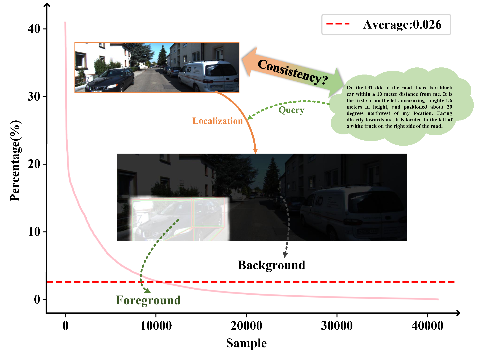
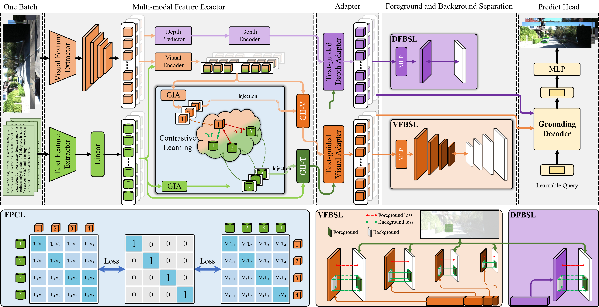
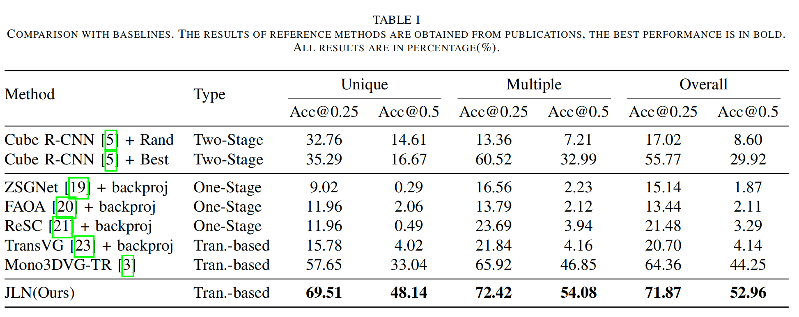
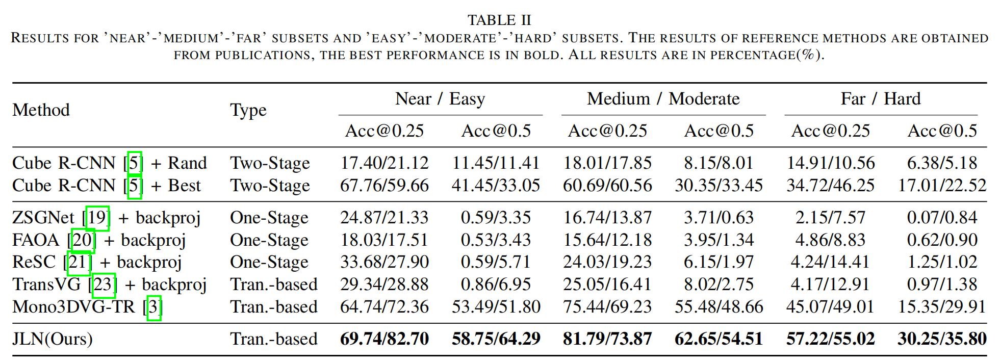

# From Contrastive to Separation: A Joint Learning Network for Monocular 3D Visual Grounding

##### Author: Chuanle Song, Yihua Huang
This is the official repository for paper **"From Contrastive to Separation: A Joint Learning Network for Monocular 3D Visual Grounding"**
## Please share a <font color='orange'>STAR ⭐</font> if this project does help


## 💬 JLN
<div align="center">
  
</div>
We proposes a Joint Learning Network(JLN). Specifically, a multi-sample feature pairs contrastive learning strategy is designed to aggregate multimodal global features. By introducing contrastive learning between global features of different samples, the proposed method enhances multimodal feature consistency within the same sample pair and discriminability between different sample pairs. Additionally, 2D region guidance is utilized to achieve foreground-background separation in both visual and depth feature learning.  Our JLN achieves a 8.16\% improvement in Acc@0.5IoU over state-of-the-art methods. Furthermore, additional experiments on the Mono3DRefer dataset further demonstrate the effectiveness of the proposed modules.
<div align="center">
  
</div>

## 🌋 Dataset
Download our Mono3DRefer dataset. We build the first dataset for Mono3DVG, termed Mono3DRefer, which can be downloaded from our [Google Drive](https://drive.google.com/drive/folders/1ICBv0SRbRIUnl_z8DVuH8lz7KQt580EI?usp=drive_link). The download link is available below:
```
https://drive.google.com/drive/folders/1ICBv0SRbRIUnl_z8DVuH8lz7KQt580EI?usp=drive_link
```

## 📦 JLN Codebase
### 1. Environment and Installation
You can follow the environment of [Mono3DVG]([https://github.com/ZrrSkywalker/MonoDETR](https://github.com/ZhanYang-nwpu/Mono3DVG/tree/main/)).

#### 1.1 Clone this project and create a conda environment: python>=3.8, our version of python == 3.10.8

#### 1.2 Install pytorch and torchvision matching your CUDA version: torch >= 1.9.0, our version of torch == 1.13.1

#### 1.3 Install requirements and compile the **Deformable DETR and Attention**.
```
    pip install -r requirements.txt

    cd lib/models/JLN/ops/
    bash make.sh
    cd ../../../..
```
#### 1.4 Download [Mono3DRefer](https://drive.google.com/drive/folders/1ICBv0SRbRIUnl_z8DVuH8lz7KQt580EI?usp=drive_link) datasets and prepare the **directory structure** as:

```
    │JLN/
    ├──Mono3DRefer/
    │   ├──images/
    │   │   ├──000000.png
    │   │   ├──...
    │   ├──calib/
    │   │   ├──000000.txt
    │   │   ├──...
    │   ├──Mono3DRefer_train_image.txt
    │   ├──Mono3DRefer_val_image.txt
    │   ├──Mono3DRefer_test_image.txt
    │   ├──Mono3DRefer.json
    │   ├──test_instanceID_split.json
    ├──configs
    │   ├──JLN.yaml
    │   ├──checkpoint_best_MonoDETR.pth
    ├──lib
    │   ├──datasets/
    │   │   ├──...
    │   ├──helpers/
    │   │   ├──...
    │   ├──losses/
    │   │   ├──...
    │   ├──models/
    │   │   ├──...
    ├──roberta-base
    │   ├──...
    ├──utils
    │   ├──...
    ├──outputs    #  save_path
    │   ├──JLN
    │   │   ├──...
    ├──test.py
    ├──train.py
    ├──val.py
```
    
You can also change the dataset path at "root_dir" in `configs/JLN.yaml`.
You can also change the save path at "save_path" in `configs/JLN.yaml`.

#### 1.5 Download pre-trained model and checkpoint

You **must** download the Pre-trained model of **RoBERTa** and **MonoDETR**.

You can download the checkpoint we provide to evaluate the Mono3DVG-TR model.
<table>
    <tr>
        <td div align="center">Models</td>
        <td div align="center">Links</td>  
        <td div align="center">File Path</td>  
        <td div align="center">File Name</td>  
    </tr>
    <tr>
        <td div align="center">RoBERTa</td> 
        <td div align="center"><a href="https://drive.google.com/file/d/1b7sOQyPmqyUMWoYZ8Vz49MRA7_-pjCpa/view?usp=drive_link">model</a></td>
        <td div align="center">`roberta-base\`</td>
        <td div align="center">`pytorch_model.bin`</td>
    </tr> 
    <tr>
        <td div align="center">Pre-trained model (MonoDETR)</td>
        <td div align="center"><a href="https://drive.google.com/file/d/1C3CCiaKHA8PImPyJyoQ9u9nIhD5ieRFJ/view?usp=sharing">model</a></td>
        <td div align="center">`configs\`</td>
        <td div align="center">`checkpoint_best_MonoDETR.pth`</td>
    </tr>  
    <tr>
        <td div align="center">Best checkpoint (JLN)</td> 
        <td div align="center"><a href="https://pan.baidu.com/s/18rtZ8jgcmd2MjrNMjyp5LA?pwd=52ks">model</a></td>
        <td div align="center">`outputs\JLN\`</td>
        <td div align="center">`checkpoint_best.pth`</td>
    </tr> 
</table>


### 2. Get Started

#### (1). Train

You can modify the settings of GPU, models and training in `configs/JLN.yaml`
```
    python train.py --config configs/JLN.yaml
```

#### (2). Test

The best checkpoint will be evaluated as default.
You can change it at "pretrain_model: 'checkpoint_best.pth'" in `configs/mono3dvg.yaml`:
```
    python test.py --config configs/JLN.yaml
```

#### (3). Inference Result

You can change it at "pretrain_model: 'checkpoint_best.pth'" in `configs/mono3dvg.yaml`:
```
    python val.py --config configs/JLN.yaml
```

## 👁️ Results and Visualization

### 1. Comparison of Different Methods.

<div align="center">
  
</div>

<div align="center">
  
</div>

### 2. Qualitative Analysis.

<div align="center">
  
</div>

### 3. Foreground focus and background suppression Visualization.

<div align="center">
  
</div>

## 🙏 Acknowledgement
Our code is based on (AAAI 2024)[Mono3DVG](https://github.com/ZhanYang-nwpu/Mono3DVG/tree/main/). We sincerely appreciate their contributions and authors for releasing source codes.

## 🤖 Contact
If you have any questions about this project, please feel free to contact songchle@mail2.sysu.edu.cn.
